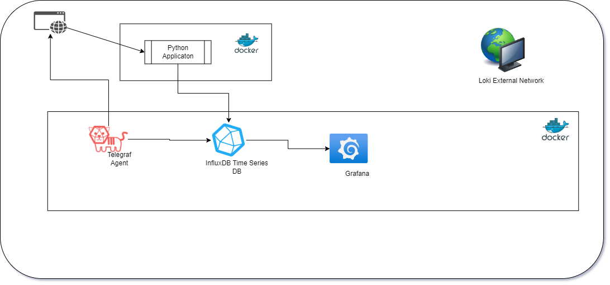
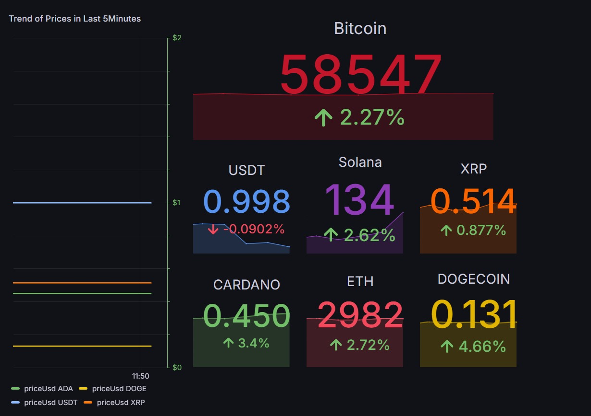

# Cryptocurrency Price Tracker with CoinCap API

## Project Overview
This project is designed to track and visualize the prices of various cryptocurrencies in real-time. It leverages the CoinCap API to fetch the latest cryptocurrency data and stores this information in an InfluxDB time-series database. The data is then visualized using Grafana, providing a dynamic and interactive dashboard that showcases trends and current values of cryptocurrencies like Bitcoin, Ethereum, and more.

## Architecture


The system architecture consists of several key components:
- **Python Application**: This component is responsible for fetching data from the CoinCap API. It runs inside a Docker container to ensure a consistent and isolated environment.
- **InfluxDB Time Series Database**: The fetched data is stored in InfluxDB, which is optimized for time-series data management. This allows for efficient data retrieval and storage.
- **Grafana**: Used for visualizing the data stored in InfluxDB. It provides a powerful interface for creating dynamic dashboards.
- **Telegraf**: Acts as an agent for collecting and reporting metrics and data, which helps in monitoring the system performance.
- **Loki External Network**: Ensures secure and reliable data communication between the services.

## Sample Output
The Grafana dashboard provides a real-time view of cryptocurrency prices, as shown in the sample image below. It displays trends over the last 5 minutes and includes percentage changes to help users quickly understand market dynamics.



## Getting Started
To get this project up and running on your local machine, follow these steps:

1. **Clone the Repository**:
   ```bash
   git clone https://github.com/gangadhar04051996/CoinCapPriceDashboard.git

2. **Navigate to the Project Directory and Run the Two Docker Compose Files**:
   ```docker-compose up --build -d

./pythonscripts/docker-compose up --build -d

3. **Open InfluxDB UI and get the API Token and update it in the script files**:
   ```Open your browser and go to http://localhost:3000
   Login with the Username ADMIN_USERNAME and password ADMIN_PASSWORD
   Go to the bitcoinprice bucket and create the API Token and replace the apitoken in the InfluxDBPusher.py 

4. **Open Grafana Web UI and configure the Datasource**:
   ```Open your browser and go to http://localhost:3000. Log in with the default credentials (admin,admin) to access the dashboards.
   Configure the datasource with username, password and API Token.git 